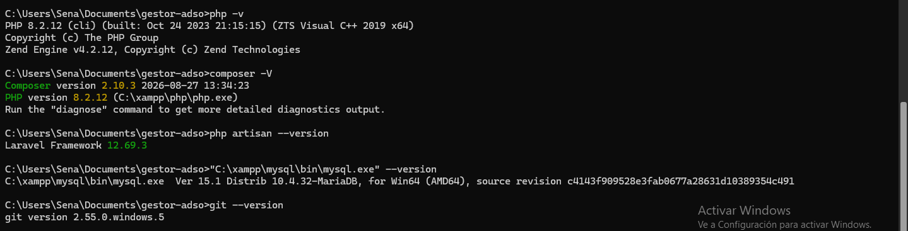
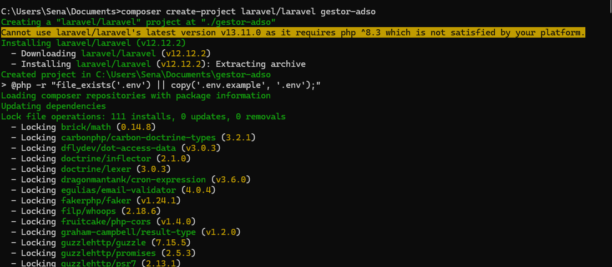
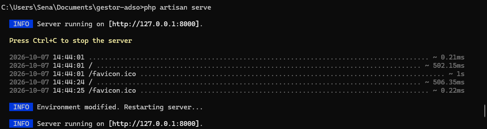
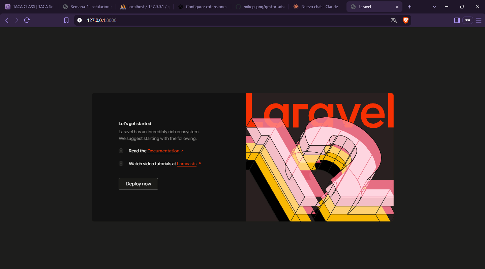
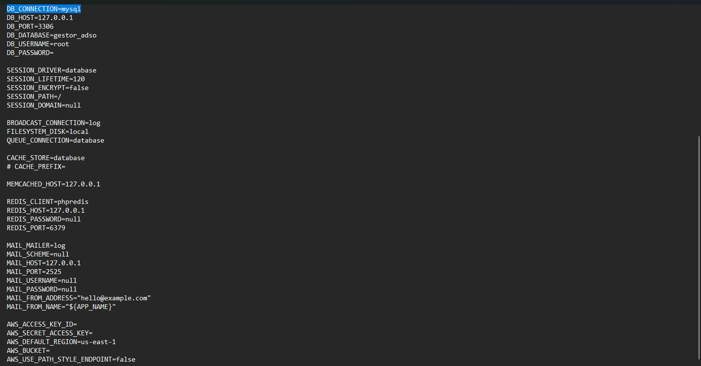
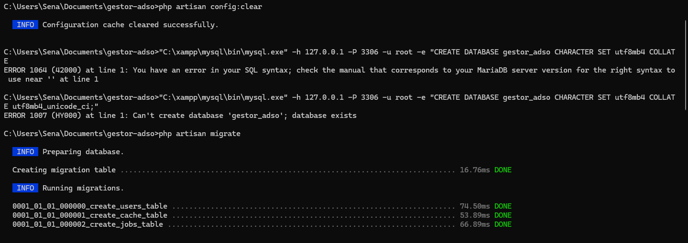
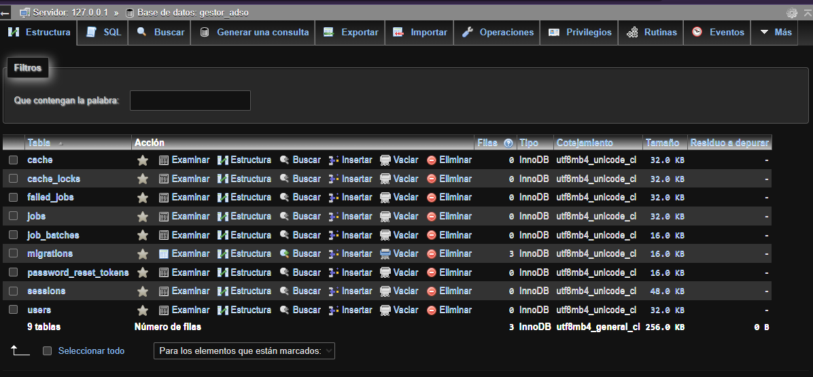
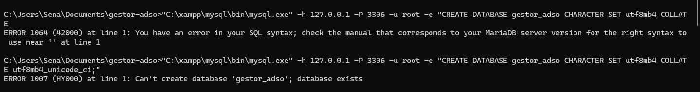
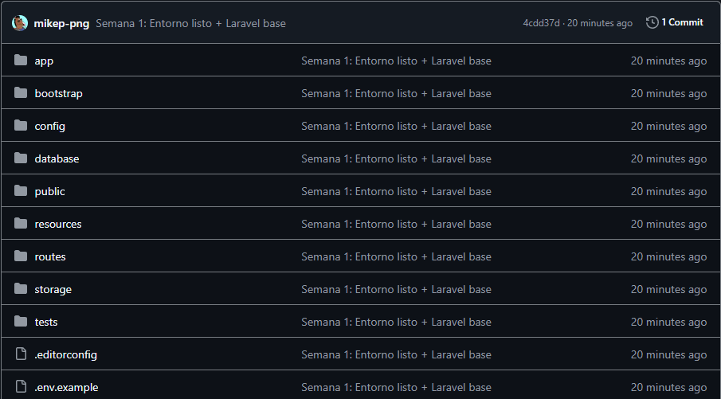
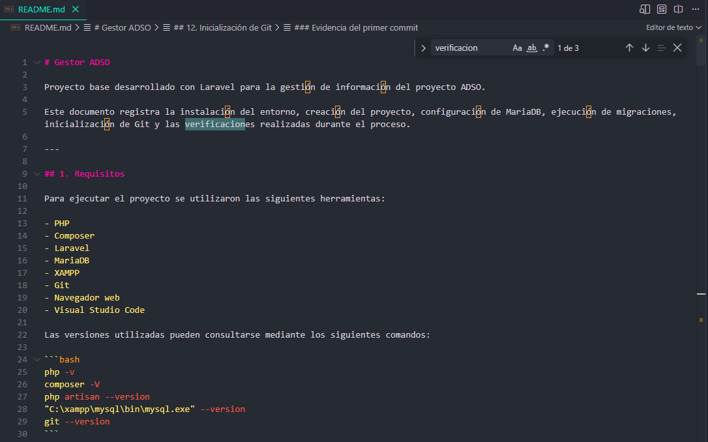

# Gestor ADSO

Proyecto base desarrollado con Laravel para la gestión de información del proyecto ADSO.

Este documento registra la instalación del entorno, creación del proyecto, configuración de MariaDB, ejecución de migraciones, inicialización de Git y las verificaciones realizadas durante el proceso.

---

## 1. Requisitos

Para ejecutar el proyecto se utilizaron las siguientes herramientas:

- PHP
- Composer
- Laravel
- MariaDB
- XAMPP
- Git
- Navegador web
- Visual Studio Code

Las versiones utilizadas pueden consultarse mediante los siguientes comandos:

```bash
php -v
composer -V
php artisan --version
"C:\xampp\mysql\bin\mysql.exe" --version
git --version
```

### Evidencia de versiones



La captura muestra las versiones de las herramientas utilizadas durante la configuración del entorno de desarrollo.

---

## 2. Creación del proyecto

El proyecto fue creado utilizando Composer desde la carpeta `Documents`.

Se ejecutó:

```cmd
cd %USERPROFILE%\Documents
composer create-project laravel/laravel gestor-adso
```

Después se ingresó a la carpeta del proyecto:

```cmd
cd gestor-adso
```

### Evidencia de creación del proyecto



La captura demuestra que el proyecto `gestor-adso` fue creado correctamente mediante Composer.

---

## 3. Ejecución del servidor local

Una vez creado el proyecto, se inició el servidor de desarrollo de Laravel mediante:

```cmd
php artisan serve
```

Laravel indicó la dirección local utilizada para acceder a la aplicación.

### Evidencia del servidor



Esta captura demuestra que el servidor de desarrollo de Laravel fue iniciado correctamente.

---

## 4. Verificación en el navegador

Para comprobar que el proyecto había iniciado correctamente, se abrió en el navegador la dirección:

```text
http://127.0.0.1:8000
```

La página inicial de Laravel se mostró correctamente.

### Evidencia de Laravel funcionando



Esta captura demuestra que el servidor local estaba funcionando y que el navegador pudo acceder correctamente a la aplicación mediante `127.0.0.1`.

---

## 5. Configuración del archivo `.env`

Se creó el archivo `.env` a partir del archivo `.env.example` mediante:

```cmd
copy .env.example .env
```

Posteriormente se generó la clave de la aplicación:

```cmd
php artisan key:generate
```

La conexión de Laravel con MariaDB se configuró utilizando los siguientes valores:

```env
DB_CONNECTION=mysql
DB_HOST=127.0.0.1
DB_PORT=3306
DB_DATABASE=gestor_adso
DB_USERNAME=root
DB_PASSWORD=
```

No se incluyen contraseñas ni secretos en este documento.

### Evidencia de configuración



La captura demuestra que Laravel fue configurado para utilizar MariaDB mediante MySQL, utilizando `127.0.0.1` como servidor local y el puerto `3306`.

---

## 6. Configuración de MariaDB

Se creó la base de datos `gestor_adso` en MariaDB utilizando XAMPP.

El comando utilizado fue:

```cmd
"C:\xampp\mysql\bin\mysql.exe" -h 127.0.0.1 -P 3306 -u root -e "CREATE DATABASE gestor_adso CHARACTER SET utf8mb4 COLLATE utf8mb4_unicode_ci;"
```

La base de datos utilizada por el proyecto es:

```text
gestor_adso
```

---

## 7. Limpieza de configuración

Después de modificar el archivo `.env`, se realizó la limpieza de la configuración almacenada por Laravel:

```cmd
php artisan config:clear
```

Esto permitió que Laravel utilizara nuevamente los valores configurados en el archivo `.env`.

---

## 8. Migraciones

Una vez configurada la conexión con MariaDB, se ejecutaron las migraciones iniciales:

```cmd
php artisan migrate
```

Las migraciones permitieron crear las tablas iniciales necesarias para Laravel.

### Evidencia de las migraciones



Esta captura demuestra que Laravel pudo conectarse correctamente con MariaDB y ejecutar las migraciones iniciales.

---

## 9. Tablas creadas en MariaDB

Después de ejecutar las migraciones, se verificó la base de datos `gestor_adso`.

La revisión permitió comprobar que las tablas creadas por las migraciones estaban presentes en MariaDB.

### Evidencia de las tablas



Esta captura demuestra que las migraciones fueron aplicadas correctamente y que las tablas fueron creadas dentro de la base de datos `gestor_adso`.

---

## 10. Dificultad técnica encontrada

Durante la creación de la base de datos se presentó un error de sintaxis SQL.

El primer comando utilizado quedó incompleto en la instrucción `COLLATE`, generando el siguiente error:

```text
ERROR 1064 (42000) at line 1: You have an error in your SQL syntax
```

El problema fue identificado y el comando se corrigió para completar correctamente la instrucción SQL.

El comando corregido fue:

```cmd
"C:\xampp\mysql\bin\mysql.exe" -h 127.0.0.1 -P 3306 -u root -e "CREATE DATABASE gestor_adso CHARACTER SET utf8mb4 COLLATE utf8mb4_unicode_ci;"
```

### Evidencia del error



Esta captura demuestra una dificultad técnica real presentada durante la configuración de MariaDB. El error permitió identificar que la instrucción SQL estaba incompleta y posteriormente corregirla.

---

## 11. Verificación del entorno

También se verificó que las herramientas necesarias estuvieran disponibles desde la terminal.

### Verificación de PHP

```cmd
php -v
```

Este comando permitió comprobar que PHP estaba instalado y disponible desde la terminal mediante el PATH del sistema.

### Verificación de Composer

```cmd
composer -V
```

Este comando permitió comprobar que Composer estaba instalado y disponible para crear y administrar proyectos Laravel.

### Verificación de Laravel

```cmd
php artisan --version
```

Este comando permitió comprobar la versión de Laravel instalada en el proyecto.

### Verificación de MariaDB

```cmd
"C:\xampp\mysql\bin\mysql.exe" --version
```

Este comando permitió comprobar la versión del cliente de MariaDB proporcionado por XAMPP.

### Verificación de Git

```cmd
git --version
```

Este comando permitió comprobar que Git estaba instalado y disponible desde la terminal.

### Evidencia de las versiones


Esta captura reúne las versiones de las herramientas utilizadas durante la configuración inicial del proyecto.

---

## 12. Inicialización de Git

Después de completar la configuración inicial del proyecto se inicializó un repositorio Git.

Se ejecutaron los siguientes comandos:

```cmd
git init
git add .
git commit -m "Semana 1: Entorno listo + Laravel base"
```

### Evidencia del primer commit



Esta captura demuestra que el proyecto fue inicializado como repositorio Git y que se realizó el primer commit con la configuración inicial de Laravel.

---

## 14. Documentación del proyecto

El proyecto cuenta con este archivo `README.md`, donde se documentan los requisitos, instalación, configuración de la base de datos, migraciones y ejecución del servidor.

### Evidencia del README



Esta captura demuestra que el proyecto cuenta con documentación para facilitar la instalación y ejecución del entorno.

---

## 15. Estructura de las evidencias

Todas las capturas utilizadas para documentar el proceso se encuentran dentro de la carpeta `capturas`.

La estructura es:

```text
gestor-adso/
├── capturas/
│   ├── 01-creacion-proyecto.png
│   ├── 02-servidor-laravel.png
│   ├── 03-laravel-navegador.png
│   ├── 04-configuracion-env.png
│   ├── 05-migraciones.png
│   ├── 06-tablas-mariadb.png
│   ├── 07-versiones.png
│   ├── 08-git-commit.png
│   ├── 10-readme.png
│   └── 11-error-mariadb.png
├── .env
├── .gitignore
├── artisan
├── composer.json
├── composer.lock
└── README.md
```

Las capturas están organizadas cronológicamente y cada una cuenta con una explicación que indica qué procedimiento demuestra y cuál fue el resultado obtenido.

---

## 16. Instalación del proyecto

Para instalar el proyecto desde cero se deben seguir estos pasos.

### 1. Crear el proyecto

```cmd
cd %USERPROFILE%\Documents
composer create-project laravel/laravel gestor-adso
```

### 2. Entrar al proyecto

```cmd
cd gestor-adso
```

### 3. Crear el archivo `.env`

```cmd
copy .env.example .env
```

### 4. Generar la clave de Laravel

```cmd
php artisan key:generate
```

### 5. Configurar la base de datos

En el archivo `.env` se deben configurar las siguientes variables:

```env
DB_CONNECTION=mysql
DB_HOST=127.0.0.1
DB_PORT=3306
DB_DATABASE=gestor_adso
DB_USERNAME=root
DB_PASSWORD=
```

La contraseña no se incluye en el README para evitar exponer información sensible.

### 6. Crear la base de datos

```cmd
"C:\xampp\mysql\bin\mysql.exe" -h 127.0.0.1 -P 3306 -u root -e "CREATE DATABASE gestor_adso CHARACTER SET utf8mb4 COLLATE utf8mb4_unicode_ci;"
```

### 7. Limpiar la configuración

```cmd
php artisan config:clear
```

### 8. Ejecutar las migraciones

```cmd
php artisan migrate
```

### 9. Ejecutar el servidor

```cmd
php artisan serve
```

Finalmente, se puede acceder al proyecto desde:

```text
http://127.0.0.1:8000
```

---

## 17. Variables necesarias del `.env`

Las variables necesarias para la conexión con MariaDB son:

```env
DB_CONNECTION=mysql
DB_HOST=127.0.0.1
DB_PORT=3306
DB_DATABASE=gestor_adso
DB_USERNAME=root
DB_PASSWORD=
```

No se deben publicar contraseñas, claves de aplicación, tokens u otros datos sensibles.

---

## 18. Comandos principales

### Laravel

```cmd
php artisan serve
php artisan config:clear
php artisan migrate
```

### Composer

```cmd
composer install
```

### Git

```cmd
git init
git add .
git commit -m "Semana 1: Entorno listo + Laravel base"
git status
git log --oneline -1
```

---

## 19. Resultado final

Al finalizar el procedimiento se obtuvo un proyecto Laravel llamado `gestor-adso`, ejecutándose mediante el servidor local de Laravel y conectado a una base de datos MariaDB llamada `gestor_adso`.

También se realizaron las migraciones iniciales, se verificaron las tablas creadas y se inicializó un repositorio Git con el primer commit del proyecto.

Las evidencias se encuentran organizadas cronológicamente dentro de la carpeta `capturas/`.

---

## 20. Lista de capturas

| Número | Archivo | Evidencia |
|---|---|---|
| 01 | `01-creacion-proyecto.png` | Creación del proyecto mediante Composer |
| 02 | `02-servidor-laravel.png` | Servidor local de Laravel ejecutándose |
| 03 | `03-laravel-navegador.png` | Página inicial de Laravel en el navegador |
| 04 | `04-configuracion-env.png` | Configuración de MariaDB en `.env` |
| 05 | `05-migraciones.png` | Limpieza de configuración y migraciones |
| 06 | `06-tablas-mariadb.png` | Tablas creadas en MariaDB |
| 07 | `07-versiones.png` | Versiones de PHP, Composer, Laravel, MariaDB y Git |
| 08 | `08-git-commit.png` | Inicialización y primer commit de Git |
| 10 | `10-readme.png` | Documentación del proyecto |
| 11 | `11-error-mariadb.png` | Error de MariaDB y posterior corrección |